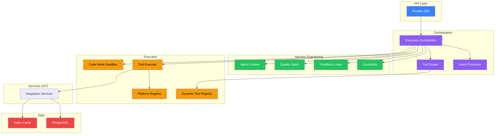

# Dependency Map

> Auto-generated on 2026-05-04 12:41
> **Do not edit manually** — regenerate with: `python scripts/generate_dep_diagram.py`

## High-Level Architecture

## Service Dependencies

```mermaid
graph LR
    classDef core fill:#3b82f6,color:#fff,stroke:#1d4ed8
    classDef harness fill:#22c55e,color:#fff,stroke:#16a34a
    classDef service fill:#6b7280,color:#fff,stroke:#4b5563
    assistantkbservice["Assistant Kb"] --> llmservice["Llm"]
    assistantkbservice["Assistant Kb"] --> pineconeservice["Pinecone"]
    autonomousagentservice["Autonomous Agent"] --> llmservice["Llm"]
    autonomousagentservice["Autonomous Agent"] --> workflowbuilderservice["Workflow Builder"]
    bilingualservice["Bilingual"] --> llmservice["Llm"]
    contentcreationservice["Content Creation"] --> conversationcontextmanager["Conversation Context Manager"]
    contentcreationservice["Content Creation"] --> llmservice["Llm"]
    conversationcontextmanager["Conversation Context Manager"] --> cacheservice["Cache"]
    conversationcontextmanager["Conversation Context Manager"] --> llmservice["Llm"]
    conversationalagentservice["Conversational Agent"] --> cacheservice["Cache"]
    conversationalagentservice["Conversational Agent"] --> conversationcontextmanager["Conversation Context Manager"]
    conversationalagentservice["Conversational Agent"] --> dynamictoolregistry["Dynamic Tool Registry"]
    conversationalagentservice["Conversational Agent"] --> llmservice["Llm"]
    conversationalagentservice["Conversational Agent"] --> orderservice["Order"]
    conversationalagentservice["Conversational Agent"] --> toolexecutor["Tool Executor"]
    conversationalagentservice["Conversational Agent"] --> whatsappservice["Whatsapp"]
    dynamictoolregistry["Dynamic Tool Registry"] --> platformregistry["Platform Registry"]
    dynamictoolregistry["Dynamic Tool Registry"] --> tooldiscoveryservice["Tool Discovery"]
    emailtemplateservice["Email Template"] --> cacheservice["Cache"]
    executionorchestrator["Execution Orchestrator"] --> dynamictoolregistry["Dynamic Tool Registry"]
    executionorchestrator["Execution Orchestrator"] --> featureflags["Feature Flags"]
    executionorchestrator["Execution Orchestrator"] --> intentprocessor["Intent Processor"]
    executionorchestrator["Execution Orchestrator"] --> toolapigenerator["Tool Api Generator"]
    executionorchestrator["Execution Orchestrator"] --> toolcontextengine["Tool Context Engine"]
    executionorchestrator["Execution Orchestrator"] --> toolexecutor["Tool Executor"]
    executionorchestrator["Execution Orchestrator"] --> toolselector["Tool Selector"]
    executionorchestrator["Execution Orchestrator"] --> toolvalidator["Tool Validator"]
    frauddetectionservice["Fraud Detection"] --> darajaservice["Daraja"]
    kbautopilotservice["Kb Autopilot"] --> llmservice["Llm"]
    kbautopilotservice["Kb Autopilot"] --> zohoservice["Zoho"]
    mpesareconciliationservice["Mpesa Reconciliation"] --> invoiceservice["Invoice"]
    mpesareconciliationservice["Mpesa Reconciliation"] --> slackservice["Slack"]
    mpesareconciliationservice["Mpesa Reconciliation"] --> xeroservice["Xero"]
    ragpipelineservice["Rag Pipeline"] --> cohereservice["Cohere"]
    ragpipelineservice["Rag Pipeline"] --> conversationcontextmanager["Conversation Context Manager"]
    ragpipelineservice["Rag Pipeline"] --> firecrawlservice["Firecrawl"]
    ragpipelineservice["Rag Pipeline"] --> llamaparseservice["Llamaparse"]
    ragpipelineservice["Rag Pipeline"] --> llmservice["Llm"]
    ragpipelineservice["Rag Pipeline"] --> pineconeservice["Pinecone"]
    ragpipelineservice["Rag Pipeline"] --> qdrantservice["Qdrant"]
    ragpipelineservice["Rag Pipeline"] --> toolexecutor["Tool Executor"]
    ragpipelineservice["Rag Pipeline"] --> unstructuredservice["Unstructured"]
    ragpipelineservice["Rag Pipeline"] --> weaviateservice["Weaviate"]
    telegramworkflowtrigger["Telegram Workflow Trigger"] --> conversationcontextmanager["Conversation Context Manager"]
    tiergate["Tier Gate"] --> featureflags["Feature Flags"]
    toolexecutor["Tool Executor"] --> accountingservice["Accounting"]
    toolexecutor["Tool Executor"] --> agritechservice["Agritech"]
    toolexecutor["Tool Executor"] --> airtableservice["Airtable"]
    toolexecutor["Tool Executor"] --> asanaservice["Asana"]
    toolexecutor["Tool Executor"] --> bilingualservice["Bilingual"]
    toolexecutor["Tool Executor"] --> clickupservice["Clickup"]
    toolexecutor["Tool Executor"] --> cohereservice["Cohere"]
    toolexecutor["Tool Executor"] --> contentcreationservice["Content Creation"]
    toolexecutor["Tool Executor"] --> conversationalagentservice["Conversational Agent"]
    toolexecutor["Tool Executor"] --> dynamictoolregistry["Dynamic Tool Registry"]
    toolexecutor["Tool Executor"] --> ecommerceservice["Ecommerce"]
    toolexecutor["Tool Executor"] --> emailtemplateservice["Email Template"]
    toolexecutor["Tool Executor"] --> featureflags["Feature Flags"]
    toolexecutor["Tool Executor"] --> filemanagementservice["File Management"]
    toolexecutor["Tool Executor"] --> firecrawlservice["Firecrawl"]
    toolexecutor["Tool Executor"] --> frauddetectionservice["Fraud Detection"]
    toolexecutor["Tool Executor"] --> healthservice["Health"]
    toolexecutor["Tool Executor"] --> hrservice["Hr"]
    toolexecutor["Tool Executor"] --> hubspotservice["Hubspot"]
    toolexecutor["Tool Executor"] --> huggingfaceservice["Huggingface"]
    toolexecutor["Tool Executor"] --> instagramservice["Instagram"]
    toolexecutor["Tool Executor"] --> inventoryservice["Inventory"]
    toolexecutor["Tool Executor"] --> jiraservice["Jira"]
    toolexecutor["Tool Executor"] --> kbautopilotservice["Kb Autopilot"]
    toolexecutor["Tool Executor"] --> kraservice["Kra"]
    toolexecutor["Tool Executor"] --> leadintelligenceservice["Lead Intelligence"]
    toolexecutor["Tool Executor"] --> linkedinservice["Linkedin"]
    toolexecutor["Tool Executor"] --> llamaparseservice["Llamaparse"]
    toolexecutor["Tool Executor"] --> llmservice["Llm"]
    toolexecutor["Tool Executor"] --> logisticsservice["Logistics"]
    toolexecutor["Tool Executor"] --> mapsservice["Maps"]
    toolexecutor["Tool Executor"] --> mpesareconciliationservice["Mpesa Reconciliation"]
    toolexecutor["Tool Executor"] --> notionservice["Notion"]
    toolexecutor["Tool Executor"] --> openaiservice["Openai"]
    toolexecutor["Tool Executor"] --> orderservice["Order"]
    toolexecutor["Tool Executor"] --> outlookservice["Outlook"]
    class telegramworkflowtrigger service
    class filemanagementservice service
    class powerbiservice service
    class kbautopilotservice service
    class leadintelligenceservice service
    class workflowbuilderservice service
    class conversationcontextmanager service
    class bilingualservice service
    class telegramservice service
    class llamaparseservice service
    class inventoryservice service
    class frauddetectionservice service
    class paymentservice service
    class intentprocessor core
    class weaviateservice service
    class socialmediaservice service
    class agritechservice service
    class mpesareconciliationservice service
    class clickupservice service
    class ragpipelineservice service
    class toolvalidator service
    class kraservice service
    class slackservice service
    class huggingfaceservice service
    class toolapigenerator service
    class teamsservice service
    class utilitiesservice service
    class realestateservice service
    class hrservice service
    class toolexecutor core
    class websocketmanager service
    class trelloservice service
    class airtableservice service
    class llmservice service
    class notionservice service
    class jiraservice service
    class zohoservice service
    class toolselector core
    class webtoolsservice service
    class orderservice service
    class workflowscheduler service
    class healthservice service
    class zoomservice service
    class whatsappservice service
    class toolcontextengine service
    class qdrantservice service
    class ecommerceservice service
    class platformregistry core
    class assistantkbservice service
    class cohereservice service
    class instagramservice service
    class salesforceservice service
    class pineconeservice service
    class mapsservice service
    class sandboxservice service
    class outlookservice service
    class dynamictoolregistry core
    class cacheservice service
    class xeroservice service
    class executionorchestrator core
    class viralengine service
    class unstructuredservice service
    class openaiservice service
    class whatsappautoreply service
    class autonomousagentservice service
    class invoiceservice service
    class darajaservice service
    class whatsappworkflowtrigger service
    class logisticsservice service
    class conversationalagentservice service
    class tooldiscoveryservice service
    class hubspotservice service
    class quickbooksservice service
    class contentcreationservice service
    class linkedinservice service
    class accountingservice service
    class emailtemplateservice service
    class firecrawlservice service
    class workflowservice service
    class asanaservice service
    class tiergate service
    class featureflags service
```

## Statistics

| Metric | Count |
|---|---|
| Service files | 23 |
| Dependency edges | 120 |
| Router-to-service mappings | 109 |
| Avg dependencies per service | 5.2 |

